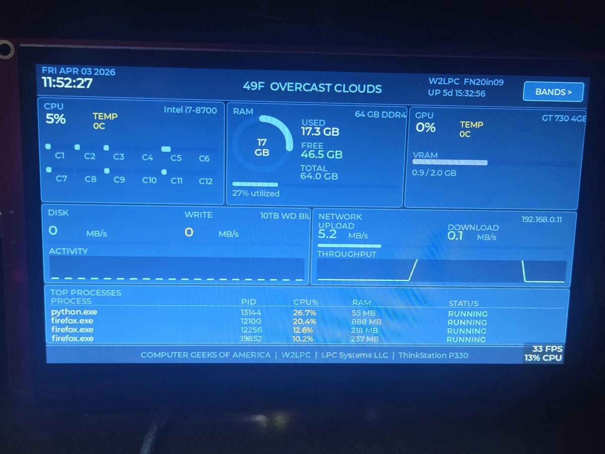
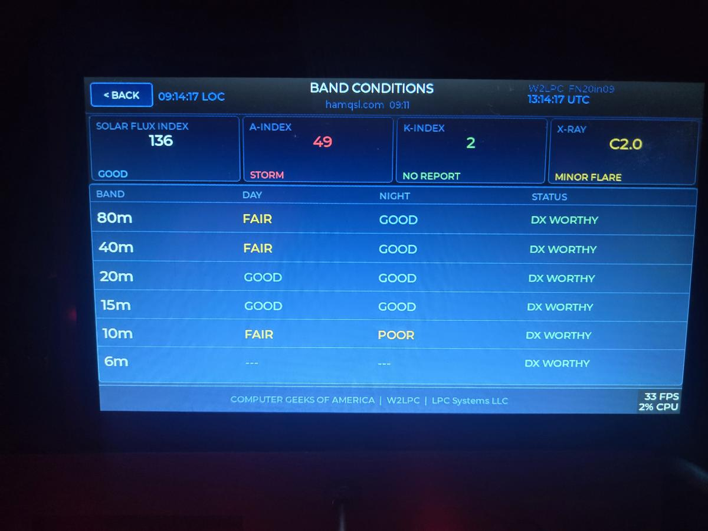

# ESP32-S3 CrowPanel Shack Monitor

This is a touchscreen display that shows:
- PC stats (CPU, RAM, disk, network)
- Ham radio band conditions

Runs on an ESP32 with a small Python program on your PC.

## Quick Start

1. Flash firmware from `/firmware`
2. Install Python packages:
   pip install flask psutil requests

3. Run:
   python daemon.py

4. Open in browser:
   http://<your-pc-ip>:5000

5. Power on the ESP32 — it connects automatically

---

ESP32-S3 CrowPanel 7" Dual-Screen Shack Monitor
W2LPC — Lou Corradi — Computer Geeks of America

OVERVIEW
A dual-screen shack companion panel for the PC built on the Elecrow CrowPanel 7" ESP32-S3 800x480 capacitive touch display. Screen 1 displays a live glassmorphism-style system monitor showing CPU, RAM, GPU, disk, network, and top processes pulled from a Python psutil daemon running on the host PC. Screen 2 displays live HamQSL band conditions showing SFI, A-Index, K-Index, X-Ray flux, and per-band day/night propagation status.
Data flows from the ThinkStation over WiFi via a Flask JSON endpoint. The ESP32 polls the daemon every second and renders the UI using LVGL v8.3.x at a locked 33 FPS.
A full self-diagnostic boot sequence runs on every power-up. Each subsystem is checked in order — hardware, network, data sources, and LVGL framebuffer. Any RED failure halts boot and holds the error on screen. YELLOW warnings pass through without halting. No silent failures.
Build time from hardware arrival to fully operational validated system: 18 hours.

HARDWARE

Elecrow CrowPanel 7.0" ESP32-S3-WROOM-1-N4R8 — SKU DIS08070H
800x480 IPS capacitive touch — GT911 touch controller
4MB OPI PSRAM confirmed
ThinkStation P330 — i7-8700, 64GB DDR4, GT730 4GB, Windows 11 Enterprise
USB-C data cable — powers the display from the PC
2.4GHz WiFi — same network as PC (5GHz NOT supported by ESP32-S3)

SOFTWARE — ESP32 SIDE
All libraries installed via Arduino IDE Library Manager unless marked BUILT-IN.
CRITICAL: Install Elecrow board package BEFORE standard ESP32 core. Do not use standard Espressif ESP32 package.
Library          Version    Notes
LVGL             8.3.x      CRITICAL — do NOT install v9, breaking API changes
TFT_eSPI         Latest     Bodmer — configure per Elecrow wiki for 7" panel
ArduinoJson      v6 or v7   Benoit Blanchon
HTTPClient       Built-in   For HamQSL XML fetch
WiFi             Built-in   Station mode
Preferences      Built-in   NVS config storage
Board Settings in Arduino IDE:

Board: Elecrow CrowPanel 7.0 (NOT standard ESP32)
Flash Size: 4MB
PSRAM: OPI PSRAM
Partition Scheme: Default 8MB with spiffs

LVGL Configuration — lv_conf.h:
Copy lv_conf_template.h from lvgl library folder to Documents/Arduino/libraries/
Rename to lv_conf.h
Key settings:
#define LV_COLOR_DEPTH 16
#define LV_HOR_RES_MAX 800
#define LV_VER_RES_MAX 480
#define LV_USE_PERF_MONITOR 1
#define LV_FONT_MONTSERRAT_12 1
#define LV_FONT_MONTSERRAT_14 1
#define LV_FONT_MONTSERRAT_16 1
#define LV_FONT_MONTSERRAT_20 1
#define LV_USE_LABEL 1
#define LV_USE_BTN 1
#define LV_USE_BAR 1
#define LV_USE_ARC 1
#define LV_USE_CHART 1
#define LV_USE_TABLE 1

SOFTWARE — PC SIDE
Python 3.11 recommended.
Package       Install command
psutil        pip install psutil
flask         pip install flask
GPUtil        pip install gputil
wmi           pip install wmi
pywin32       pip install pywin32
Install all at once:
pip install psutil flask gputil wmi pywin32

Daemon location: C:\ELECROW\stats_server.py
Endpoint: http://192.168.0.11:5000/stats
Bind address: 0.0.0.0:5000
Run as Windows service using NSSM (Non-Sucking Service Manager — nssm.cc):
nssm install ElecrowDaemon python C:\ELECROW\stats_server.py
nssm start ElecrowDaemon

IMPORTANT: Set a DHCP reservation in your router for the PC MAC address.
The ESP32 needs a fixed IP to reach the daemon reliably.
PC MAC: 00:00:00:00:00:00 — reserved at 192.168.0.11 on Router.

GPU TEMPERATURE NOTE:
GT730 does not support NVML. GPUtil returns 0C for GPU temperature on this card.
CPU temperature via psutil on Windows also returns 0C without OpenHardwareMonitor.
Both display as 0C — cosmetic gap only, does not affect function.
Fix pending in a future revision.

BOOT DIAGNOSTIC SEQUENCE
The boot screen runs a full self-diagnostic before launching the main display.
Each check appears line by line with live feedback.
RED = halt. YELLOW = warn, boot continues. GREEN = pass.
Phase       Check                  API Call                    On Fail
HARDWARE    Display driver init    tft.init()                  RED halt
HARDWARE    Touch controller       touch.begin()               YELLOW warn
HARDWARE    PSRAM detected         esp_psram_get_size()        RED halt
HARDWARE    PSRAM >= 4MB           esp_psram_get_size()        RED halt
NETWORK     WiFi connect           WiFi.begin() + timeout      RED halt
NETWORK     IP assigned            WiFi.localIP()              RED halt
NETWORK     Signal strength        WiFi.RSSI()                 YELLOW warn
DATA        psutil daemon          HTTP GET /stats 200 OK      RED halt
DATA        JSON parse valid       deserializeJson()           RED halt
DATA        HamQSL XML             HTTP GET hamqsl.com         YELLOW warn
LVGL        Framebuffer            lv_mem_monitor()            RED halt
LVGL        Heap >= 2MB            esp_get_free_heap_size()    YELLOW warn

GT911 TOUCH CONTROLLER NOTE:
GT911 reports WARN during boot — this is a known reset sequence timing issue.
Touch IS functional despite the WARN. Boot continues normally.
This is a non-halting condition. Do not be alarmed.

KNOWN ISSUES

GT911 touch controller shows WARN during boot sequence.
Touch works normally. Reset sequence timing is the cause.
Status: Non-halting, touch functional, fix pending.
CPU and GPU temperature display 0C on ThinkStation P330 with GT730.
GT730 does not support NVML. psutil returns 0C for CPU temp on Windows
without a hardware monitor backend.
Status: Cosmetic only, fix pending.
HamQSL XML returns HTTP 301 on first boot — cached data displayed.
Subsequent polls resolve correctly.
Status: Non-critical, expected behavior.

VALIDATED CONFIGURATION
Boot diagnostic result: ALL SYSTEMS GO
FPS: 33 locked
PSRAM: 8.0MB confirmed
Heap free at launch: 7.5MB
WiFi signal at validation: -28 dBm to -41 dBm
psutil daemon: 192.168.0.11:5000 confirmed
HamQSL XML: Connected, HTTP 301 cached data on first boot
Validation date: April 3, 2026
Validation performed by: W2LPC

WEB DASHBOARD
The Flask daemon also serves a full web UI at http://192.168.0.11:5000
Tabs: System Monitor and Band Conditions
Mirrors the panel display exactly
Accessible from any browser on the local network

REFERENCE LINKS
Elecrow CrowPanel 7" product page:
https://www.elecrow.com/crowpanel-7-0-hmi-display-esp32-800x480.html

Elecrow Wiki — User_Setup.h, board package URL, demo firmware:
https://www.elecrow.com/wiki/esp32-display-7-0-inch-hmi-display.html

Elecrow GitHub — board package source:
https://github.com/Elecrow-RD/esp32-s3-arduino

LVGL v8.3.x:
https://github.com/lvgl/lvgl/tree/release/v8.3

LVGL v8 documentation:
https://docs.lvgl.io/8.3/

TFT_eSPI by Bodmer:
https://github.com/Bodmer/TFT_eSPI

ArduinoJson:
https://arduinojson.org/

psutil documentation:
https://psutil.readthedocs.io/en/latest/

HamQSL band conditions XML feed:

http://www.hamqsl.com/solarxml.php

NSSM — Non-Sucking Service Manager:

https://nssm.cc/download

REPOSITORY CONTENTS
firmware/          ESP32 Arduino sketch — main application
daemon/            Python Flask stats daemon — stats_server.py
docs/              PDF reference guide — libraries and setup
images/            Validation photos — boot sequence and running screens

LICENSE
MIT License
Copyright 2026 Lou Corradi W2LPC 
Permission is hereby granted, free of charge, to any person obtaining a copy of this software to use, copy, modify, merge, publish, distribute, sublicense, and/or sell copies of the software, subject to the following conditions: The above copyright notice and this permission notice shall be included in all copies or substantial portions of the software.
THE SOFTWARE IS PROVIDED AS IS, WITHOUT WARRANTY OF ANY KIND.

73 de W2LPC — Computer Geeks of America

April 2026

